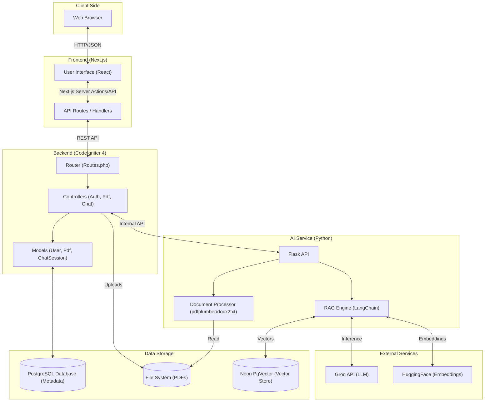
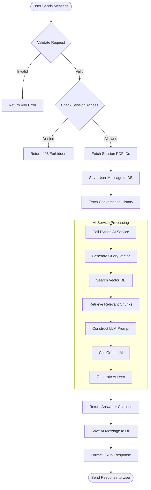
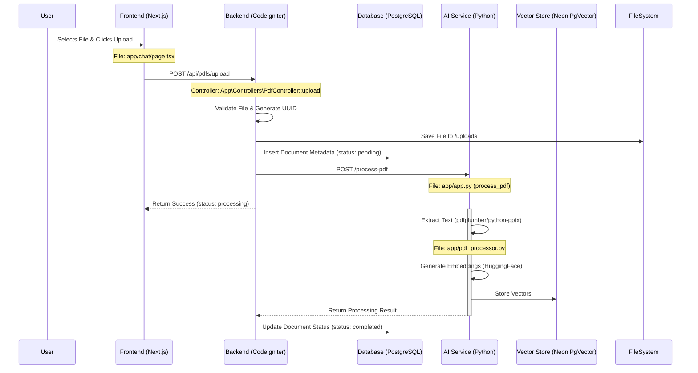
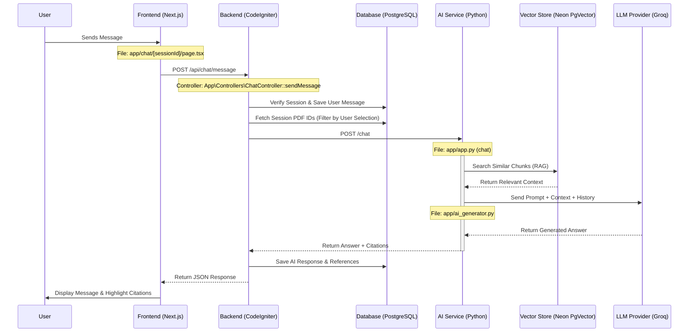
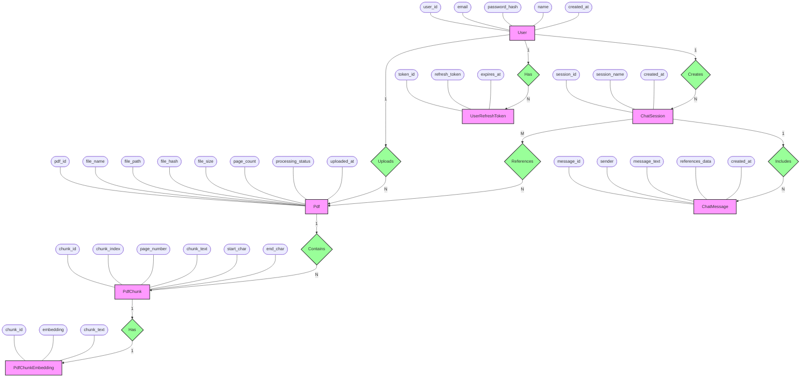

# System Workflow Diagrams

This document visualizes the key workflows of the "Chat With PDF" application, mapping user actions to specific files and API endpoints.

## 1. High-Level System Architecture

This diagram shows the overall structure of the application and how the different components interact.

## 2. Activity Diagram: Chat with PDF

This diagram details the step-by-step logic flow when a user sends a message to the chat.

## 3. Document Upload & Processing Workflow

This flow describes how a document is uploaded, stored, and processed for AI interaction.

## 4. Chat Interaction Workflow (Sequence)

This flow illustrates how a user's question is processed to generate a context-aware response.

## 5. ER Diagram (Chen Notation)

This diagram represents the database entities, their attributes, and relationships based on the exact SQL schema.

## Key Components Map

| Component | Technology | Key Files |
| :--- | :--- | :--- |
| **Frontend** | Next.js 15 | `app/chat/page.tsx`, `app/chat/[sessionId]/page.tsx`, `lib/api.ts` |
| **Backend** | CodeIgniter 4 | `app/Config/Routes.php`, `app/Controllers/PdfController.php`, `app/Controllers/ChatController.php` |
| **AI Service** | Python (Flask) | `app/app.py`, `app/pdf_processor.py`, `app/ai_generator.py` |
